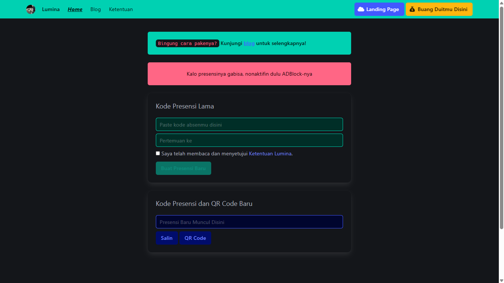
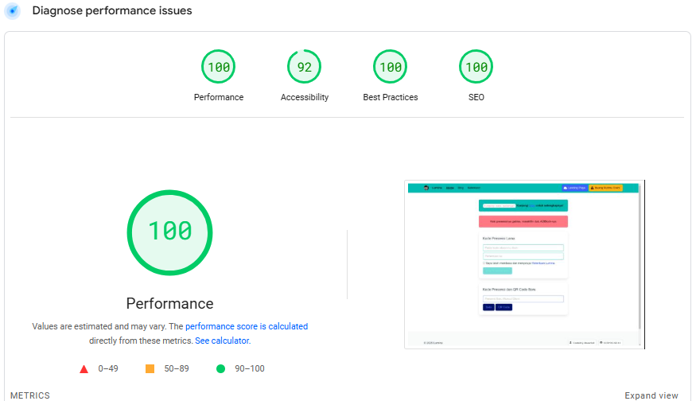
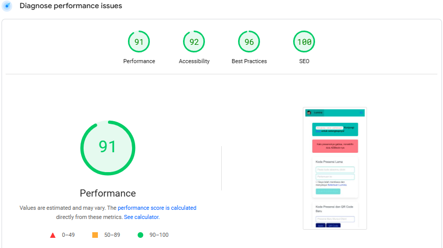

# ✨ Lumina: Jangan Biarkan Presensi Menghantui Kuliahmu! ✨

**Pernahkah kamu merasa panik karena lupa belum presensi kuliah?** Tenang, kamu tidak sendirian! **Lumina** hadir sebagai solusi andalan untuk kamu yang seringkali terlewat melakukan presensi. Kami memahami betapa pentingnya presensi dalam perkuliahan dan tidak ingin hal ini menjadi penghalang kesuksesan akademikmu. Lumina dirancang agar kamu dapat mengatasi masalah lupa belum presensi dengan **mudah, cepat, dan tanpa ribet!**

## 🤔 Mengapa Lumina Hadir?

Sebagai mahasiswa, kita semua pernah mengalami situasi **lupa belum presensi**. Kami menyadari bahwa **LUpa MIn iziN Absen** adalah masalah umum yang bisa terjadi pada siapa saja, terutama di tengah kesibukan aktivitas perkuliahan. Oleh karena itu, Lumina hadir sebagai pengingat bahwa **ketidaksempurnaan manusia seperti lupa belum presensi, tidak boleh menjadi penghalang kesuksesan akademik Anda.** Lumina hadir sebagai solusi atas kelupaan belum presensi.

**Penting untuk diingat:** Lumina diperuntukkan bagi mahasiswa yang *benar-benar lupa* melakukan presensi. **Lumina tidak ditujukan untuk memfasilitasi tindakan bolos atau penyalahgunaan lainnya.** Kami percaya pada integritas akademik dan penggunaan Lumina secara bertanggung jawab.

## ⚙️ Bagaimana Lumina Bekerja?

**Lumina adalah generator kode presensi otomatis!** Tidak perlu lagi khawatir jika lupa belum presensi. Caranya sangat mudah:

1. **Copy-Paste:** Salin kode presensi lama yang terenkripsi ke kolom yang tersedia.
2. **Masukkan Nomor Pertemuan:** Isi nomor pertemuan yang sesuai.
3. **Buat Presensi Baru:** Klik tombol "Buat Presensi Baru".

Dalam sekejap, kamu akan mendapatkan kode presensi baru yang terenkripsi dan siap digunakan! Sangat simpel, bukan? Ini adalah cara cerdas untuk mengatasi masalah **LUpa MIn iziN Absen**, terutama saat kamu lupa belum presensi.

## 💫 Desain Intuitif, Mudah Digunakan Saat Panik

Kami menyadari bahwa teknologi seharusnya memudahkan hidup, terutama saat kita sedang menghadapi situasi **lupa belum presensi**. Oleh karena itu, Lumina dirancang dengan antarmuka yang **simpel, bersih, dan mudah dipahami.** Bahkan jika kamu tidak terlalu ahli dalam teknologi, kamu tidak perlu khawatir. Prosesnya pun sangat mudah dan tidak ribet, bahkan dalam keadaan panik karena lupa belum presensi. Hanya dengan beberapa langkah sederhana, kode presensi kamu akan langsung tersedia. Dengan demikian, waktu kamu menjadi lebih efektif untuk hal-hal yang lebih penting, bukan malah terbuang karena khawatir soal lupa belum presensi.

## 🚀 Keunggulan Lumina

- **Solusi Instan:** Memberikan solusi cepat dan tepat untuk masalah lupa belum presensi.
- **Generator Kode Otomatis:** Menghasilkan kode presensi baru dalam sekejap.
- **Akses Mudah:** Dapat diakses kapan saja dan di mana saja, baik melalui laptop maupun HP!
- **Enkripsi Aman:** Proses enkripsi kode presensi aman dan terpercaya.

## ⚠️ Catatan Penting

Mungkin ada sedikit kendala teknis, terutama jika kamu menggunakan AdBlocker atau ekstensi browser lainnya. Untuk sementara waktu, **nonaktifkan AdBlocker** agar Lumina dapat berfungsi dengan lancar, terutama saat kamu sedang panik karena lupa belum presensi. Kami terus berupaya untuk meningkatkan kualitas dan performa Lumina agar selalu memberikan yang terbaik bagi pengguna.

## 📞 Butuh Bantuan?

Jika ada pertanyaan atau membutuhkan bantuan, jangan ragu untuk menghubungi kami! Kami hadir untuk membantu Anda mengatasi masalah lupa belum presensi.

## 💻 Intip Tampilan Lumina

Berikut adalah cuplikan antarmuka Lumina:

## 🚀 Performa Teruji: PageSpeed Insights

Kami berkomitmen untuk memberikan pengalaman terbaik, termasuk kecepatan akses. Lihat sendiri hasil uji performa Lumina menggunakan PageSpeed Insights:

**[Lihat Hasil PageSpeed Insights](https://pagespeed.web.dev/analysis/https-lumina-ridwaanhall-me/wxlbbi2myv)**

### Desktop

### Mobile

## 🛠️ Teknologi yang Kami Gunakan

Lumina didukung oleh berbagai teknologi canggih untuk memastikan kinerja dan pengalaman pengguna yang optimal:

- **Analitik:** Cloudflare Browser Insights
- **Keamanan:** HSTS
- **Font:** Font Awesome (6.4.0)
- **Fitur Lain-lain:** PWA (Progressive Web App), Open Graph, HTTP/3
- **CDN:** jsDelivr, cdnjs, Cloudflare
- **Library JavaScript:** crypto-js (4.1.1)
- **Platform Hosting:** Vercel
- **Framework UI:** Bulma (1.0.2)
- **Real User Monitoring (RUM):** Cloudflare Browser Insights
- **Performa:** Cloudflare Zaraz

## 🚀 Jangan Biarkan Lupa Absen Mengganggumu

Lumina siap menjadi sahabat setia dalam perjalanan kuliahmu. Kemudahan akses dan tampilan yang intuitif akan membuat hidupmu lebih tenang.

[**Kunjungi Lumina Sekarang!**](https://lupa-presensi.vercel.app/)

## 📄 Ketentuan Penggunaan

Dengan menggunakan Lumina, Anda menyetujui [Ketentuan Penggunaan](https://lupa-presensi.vercel.app/terms/).

---

### #Lumina #LupaAbsen #SolusiAbsensi #AbsenKuliah #Mahasiswa #GeneratorPresensi #TeknologiPendidikan #PWA #Cloudflare #Vercel #Bulma
